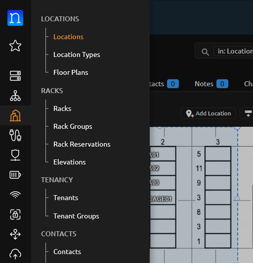
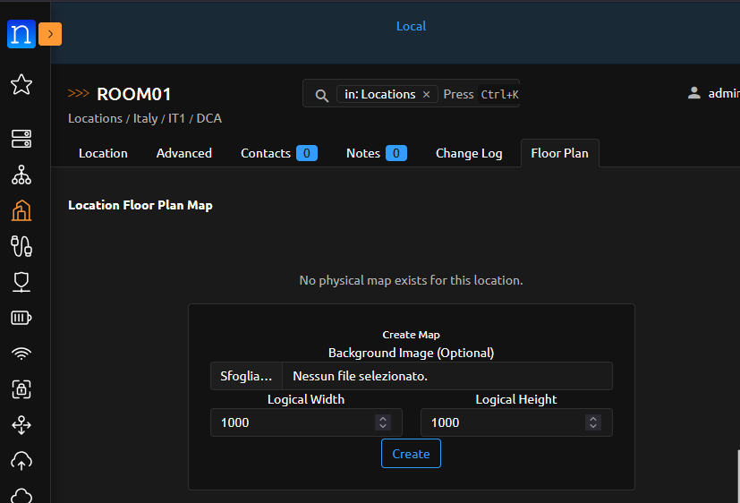
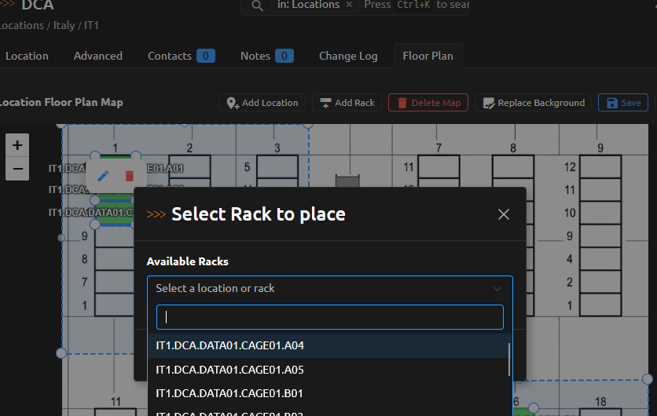
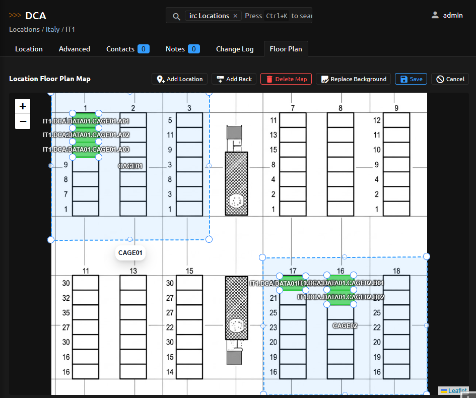
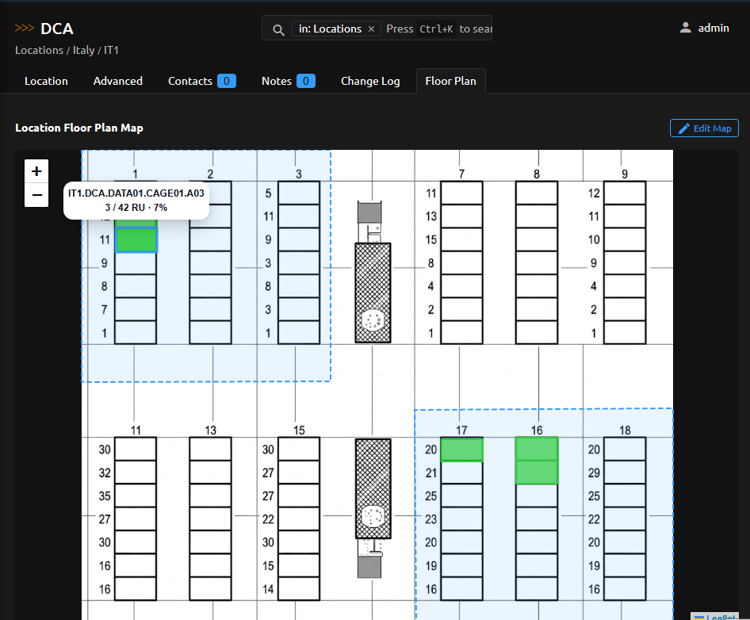
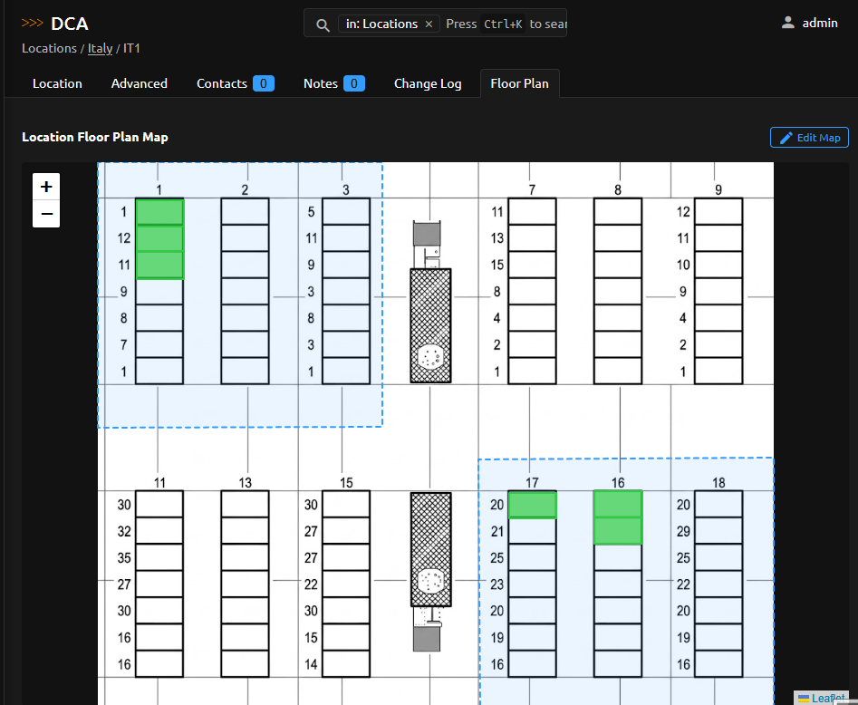

# Getting Started

This guide walks you through the basic workflow for creating and editing a location floor plan.

## Before you begin

1. Create the Nautobot Location hierarchy and Racks you want to show on the map.
2. Give the user **Location** and **Rack** view permissions, plus **Location Floor Plan** map and placement permissions.

## Create a floor plan

1. Open the parent Location and select **Location Floor Plan**.

   
   *Open a Location page and choose **Location Floor Plan** from the menu.*

2. Select **Add** and create a map by entering a logical width and height.

   
   *The Add floor plan dialog, where you set the logical dimensions.*

3. Optionally upload a PNG, JPEG, or SVG image to use as the background.
4. Use the picker to add unused descendant Locations and Racks to the map.

   
   *Use the picker to drag a Rack onto the canvas.*

5. Draw or edit shapes with Leaflet 1.9.4 and Geoman Free 2.20.0.
6. Save the snapshot.

*The full floor plan editor lets you place racks and locations, draw shapes, and upload a background image.*

## View and maintain a floor plan

Open a saved floor plan to see the current layout. Rack usage colors are calculated live from Devices mounted in the Rack; no rack usage data is stored by Location Floor Plan.

*Hover over a placed Rack in the view to see live utilization details.*

*The floor plan view shows the saved layout, including placed racks and descendant locations.*

## Editing conflicts

If another user saves changes while you are still editing, save again after the HTTP 409 revision conflict response to reload the latest snapshot before continuing.
