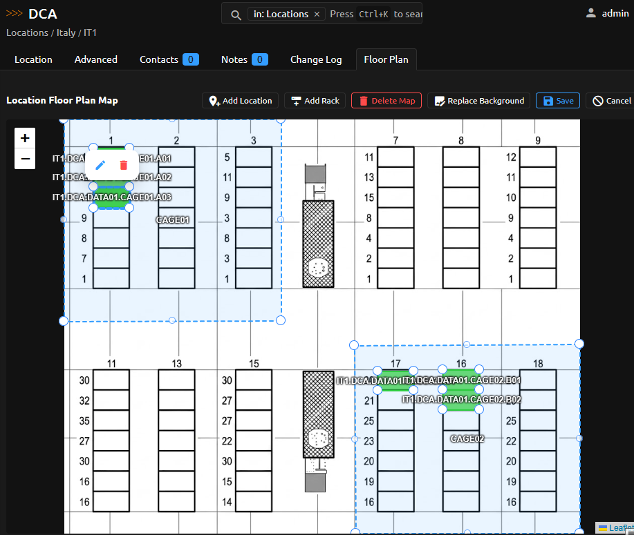

# Using the App

## Editor workflow

The tab loads `GET /api/plugins/location-floor-plan/locations/{location_id}/resolved-map/`, renders the inherited or own map, and uses `GET /api/plugins/location-floor-plan/floor-plans/{id}/descendants/` as the picker for unused child Locations and Racks. A save sends `PUT /api/plugins/location-floor-plan/floor-plans/{id}/snapshot/` with the current revision.

## Shape colors

Each Location or Rack placement can have an optional color override. Select a shape while editing and use the palette button to pick a color. Resetting clears the override and falls back to the target style, utilization palette (for racks), or the configured global default. Target-level defaults persist through `/api/plugins/location-floor-plan/location-styles/` and `/rack-styles/`.

## REST endpoints

The tab loads `GET /api/plugins/location-floor-plan/locations/{location_id}/resolved-map/`, renders the inherited or own map, and uses `GET /api/plugins/location-floor-plan/floor-plans/{id}/descendants/` as the picker for unused child Locations and Racks. A save sends `PUT /api/plugins/location-floor-plan/floor-plans/{id}/snapshot/` with the current revision.

*Hover over a placed Rack while editing to preview live utilization details.*

## REST endpoints

| Endpoint | Use |
| --- | --- |
| `/floor-plans/` | List/create maps. |
| `/floor-plans/{id}/snapshot/` | Read/replace all placements. |
| `/floor-plans/{id}/background/` | Download/upload normalized background PNG. |
| `/floor-plans/{id}/descendants/` | Picker data. |
| `/location-placements/` | Location placement CRUD. |
| `/rack-placements/` | Rack placement CRUD. |
| `/location-styles/` | Persistent Location color style CRUD. |
| `/rack-styles/` | Persistent Rack color style CRUD. |
| `/locations/{location_id}/resolved-map/` | Resolved renderer payload. |

Writes require `If-Match: <revision>` or `expected_revision`; map creation requires `If-None-Match: *` or revision `0`. Conflicts return 409.

## Stale placements

When hierarchy moves make placements invalid, snapshots report stale records separately. Delete them through snapshot `delete_stale_ids` or ask an administrator to run `nautobot-server audit_location_floor_plan --cleanup`.
